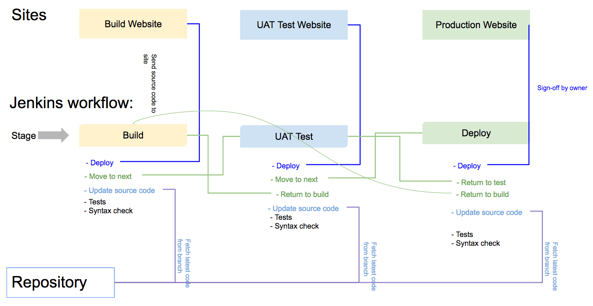

workflow-script (Demo script not for production)
===============

Groovy script for workflow Jenkins plugin

> This is work in progress script for [Jenkins workflow plugin](https://github.com/jenkinsci/workflow-plugin)

## Introduction

The script creates workflow consists of 3 stages (Build, UAT Test, Production deploy). There are allocated group for each stage that the members a group can only access or make action on their stage. For example, If the current active stage is *UAT Test*, then only the memeber of the *testers* group can preform actions on the current build.



## Example,

- Application stored in github repository: https://github.com/satrun77/TestApp
- The following branches exists in the repository:
   - master
   - feature-1
- The company that manages the application has the following teams:
   - Developers
   - Testers
   - Mergers (Staff that can release changes to production in deploy stage)
   - Product owner (Staff that can approve changes for release in deploy stage)
   
## Workflow

### Setup

1. Add the following files to the root directory of the repository
	- jenkins.groovy: This file contains the main script for test the application.
	- jenkins.json: Configuration files defines
		- The members of each team (testers, developers, deployers)
		- The name of the branch to build
		- Name of the buisness owner (The owner of this change that this branch is created for). This value used as sign-off in the last stage *Deploy*.

2. Create a job in Jenkins type *workflow*
3. Create build parameter named *BRANCH_TO_BUILD*. This is the name of the branch to fetch and build.
3. Add the content of the file *textarea.groovy* to the textarea in the job configuration page.
4. At the top of the file *textarea.groovy* there are configration details that can be editted.

### Explaining textarea.groovy

#### Line 7:
Import a json library used to read the configuration file from the repository *jenkins.json*


```
import groovy.json.JsonSlurper
```

#### Line 9:

Defines variable for the main workflow object. This variable is to access all methods and properites defined in file *jenkins.groovy* 

```
def flow
```

#### Line 11-25:

Configuration items that must be changed to reflect the current created job.

The job workspace structured as follows:

- ../workspace/
	 - **Branch name**: Value extracted from the job parameter *BRANCH_TO_BUILD*
	 	- **src**: Contains the source code from the repository.
	 	- **jenkinsdata**: Directory to store any information about the build.


```
// Directory to store information about the job
def dataDir = 'jenkinsdata'

// Directory to clone the source code into
def srcDir = 'src'
```

***Warning bad configurations***

Defines the username and password for Jenkins admin account!!!! It is used for an API request to update the buld description.

> This demo script created for proof of concept. I was unable to find a way to change the build information while the build is active. Using the API was the easit way. If this script to be used in production, this step have to be changed.


```
def jenkinsUser = 'jenkins'
def jenkinsPass = '123'
```

Defines the details for the source control. Use the helper tool in the job configuration page to generate the code for SCM and then extract the data from the output.

- scmUrl: The repository url.
- scmcredentialsId: Credentials Id that can access the repository.
- scmBrowser: (Optional) SCM browser settings. You can leave this as empy array *[]*
 
```
def scmUrl = 'git@repourl:project/name.git'
def scmcredentialsId = '8e7af354-c1fb-4298-a455-0d672a96b863'
def scmBrowser = [$class: 'GitLab', repoUrl: 'http://repourl/project/name/', version: '7.4']
```

#### Line 27-30:

Make sure that the build triggered with a value of the branch name.

```
if (BRANCH_TO_BUILD == '') {
    throw new hudson.AbortException("[Error] build started without specifying a branch name")
}
```

#### Line 32-65:

The main workflow script execution.

1. Inside a node
	- Send an API request to update the build description to add the name of the banch name. This is going to be visible in the build history.
	- Create a directory in the workspace named by the branch name and change the current directory to it.
	- Shell script command to create the directory to store information about the build.
	- Create a directory in  branch name directory named *src* to checkout the source code into.
	- Checkout the source code for the branch specified.
	- Load the main script *jenkins.groovy* into the `flow` variable.
	- Execute `updateSourceCode` method to make sure that we are working on the latest code from the branch.
	- Set properties in the `flow` object.
		- Parse the configuration file.
		- The branch name.
		- List of testers, developers, deployers.
		- etc ...
			
2. Start the build `flow.executeBuild()`. Each stage is going to be executed in its own node.

### Explaining jenkins.groovy

#### Line 8-27:

Defines properties used within the namespace of the script. The values of these properties were set by the *textarea.groovy* [Lines 32-65](#Line 32-65:)

The only property that is not set is `masterUser`. It holds a list of users that can access all the stages of the workflow. e.g. It can executes tests in stage **Build**, **UAT Test**, **Deploy**.

#### Line 31-41:

The definition of the main method to start the build. 

Within a node it change the current directory to branch name / src. Then execute the first stage **Build**

```
def executeBuild() {
    // Build in subdirectory match the branch name
    node {
        dir (branchName) {
            dir (srcDir) {
                // Start Buid stage
                buildStage()
            }
        }
    }
}
```

#### Line 43-103:

Defines 3 methods for each stage in the workflow. Each stage can preform some actions on the build.

##### Build Stage
```
def buildStage() {
	// ...
	
```

First we define that this is build stage

```
	// ...
    
    stage 'Build'
```

Start an infinite loop. Start by asking the user what would like to do in the current stage. (e.g. Start unit testing, or check for syntax errors, or release changes to the stage enviroment, ...etc)

The build will stay in the current stage until the user select the option to *Move to test stage*. Then after completing all actions, the current stage changes to test stage and exit the infinite loop.

```
	// ...

    stageAction = true
    while (stageAction) {
        def buildAction = askQuestion('build')
        processStageActions('build', buildAction)
        if (buildAction['Move to'] == 'Move to test stage') {
            stageAction = false
            // Start Test stage
            testStage();
            break;
        }
    }
}
```

##### UAT Test Stage
It is same as **Build Stage** with exception that the testers have the option to return to build stage if for some reason there were issues in the application that need the attention of the developers to fix before moving to the next stage **Deploy**

```
def testStage() {
	// ...
	
```

##### Deploy Stage

It is same as **Build Stage** with exception that the deployers have the option to return to build stage or test stage.

Also, deploying changes to production enviroment have to be approved by the change/business owner by entering the value **owner** from the configuration file **jenkins.json**. The idea here is that the buisness owner can login into Jenkins and approved changes they have access to. Also, this option should only be visible to business owners (Currently not implemented in this demo).


```
def deployStage() {
	// ...
	
```

#### Line 105-153:

This method construct the user interface for each stage.

```
def askQuestion(stageType) {
	// ...
```

Get the username of the master user. If the current logged user match this id, then the user is allowed the access to execute actions within the stage.

```
	// ...
	
	def submitter = masterUser.iterator().next().getKey()
```	

Check if the current login user in the list of current stage group. e.g. We are in test stage, then if the username of the login user in the **testers** list.

The value stored in submitter variable for later use.

```
	// ...
	
    if (stageType == 'build') {
        if (developers.containsKey(hudson.model.User.current().id)) {
            submitter = hudson.model.User.current().id
        }
    } else if (stageType == 'test') {
        if (testers.containsKey(hudson.model.User.current().id)) {
            submitter = hudson.model.User.current().id
        }
    } else if (stageType == 'deploy') {
        if (deployers.containsKey(hudson.model.User.current().id)) {
            submitter = hudson.model.User.current().id
        }
    }
```

Create an array that holds checkbox elements that are available in all stages.
	- Would you like to start Unit tests. (PHPUnit tests)
	- Would you like to start Behavior-driven development tests (Behat)
	- Would you like to start files syntax check
	- Would you like to update the source code before starting actions.
	
```
	// ...
	
    def params = [
        [$class: 'hudson.model.BooleanParameterDefinition', defaultValue: false, description: 'PHP Unit tests', name: 'Unit test'],
        [$class: 'hudson.model.BooleanParameterDefinition', defaultValue: false, description: 'Behat tests', name: 'Behat test'],
        [$class: 'hudson.model.BooleanParameterDefinition', defaultValue: false, description: 'Files syntax check', name: 'Syntax test'],
        [$class: 'hudson.model.BooleanParameterDefinition', defaultValue: false, description: 'Update source code', name: 'Update code'],
    ]
```


Create select element for move options between stages.
```
	// ...
	
    def moveOptions = 'Stay in current stage\n'

    if (stageType == 'build') {
        moveOptions += 'Move to test stage\n'
    }
    if (stageType == 'test') {
        moveOptions += 'Return to build stage\n'
        moveOptions += 'Move to deploy stage\n'
    }
    if (stageType == 'deploy') {
        moveOptions += 'Return to build stage\n'
        moveOptions += 'Return to test stage\n'
    }

    params.add([$class: 'hudson.model.ChoiceParameterDefinition', choices: moveOptions, description: 'Move to another stage', name: 'Move to'])
```

Create checkbox element for action to deploy the build to its environment. e.g. in test stage you would deploy the build to the UAT environment and then notifiy users to preview the build.

```
	// ...
	
    params.add([$class: 'hudson.model.BooleanParameterDefinition', defaultValue: false, description: 'Would you like to deploy code after successful test to ' + stageType + ' environment?', name: 'Deploy build'])
```

In **Deploy Stage** only, ask the user to sign-off the change before deploying the build to production environment. The value of this text field must match the property **owner** in the configuration file.

```
	// ...
	
    if (stageType == 'deploy') {
        params.add([$class: 'hudson.model.StringParameterDefinition', defaultValue: branchSavedOwner, description: 'The workflow can\'t complete without the owner sign off', name: 'Branch Owner'])
    }
```


Create the input elements with the following parameters:
- id: Can be anything. This is the name of the input.
- message: Test to be displayed at the top.
- ok: The label of the button to continue processing.
- submitter: The username of the user who can preform this action. By default only administrator can do it, but if the logged in user belong to the group of the current stage, then the value will match that username.
```
	// ...

    def buildAction = input id: '7fd85613e7e068ad4f3bec8e717f2bc8', message: 'What would you like to do in ' + stageType + ' stage?', ok: 'Proceed', parameters: params, submitter: submitter
    return buildAction
}

```

#### Line 155-212:

This method preform actions for a stage.

```
def processStageActions(stageType, actions) {
	// ...
```

#### Line 214-235:

Defines method for each test...


#### Line 241:

see [Workflow-docs](https://github.com/jenkinsci/workflow-plugin/blob/master/TUTORIAL.md#loading-script-text-from-version-control)

```
// ...

return this;
```


